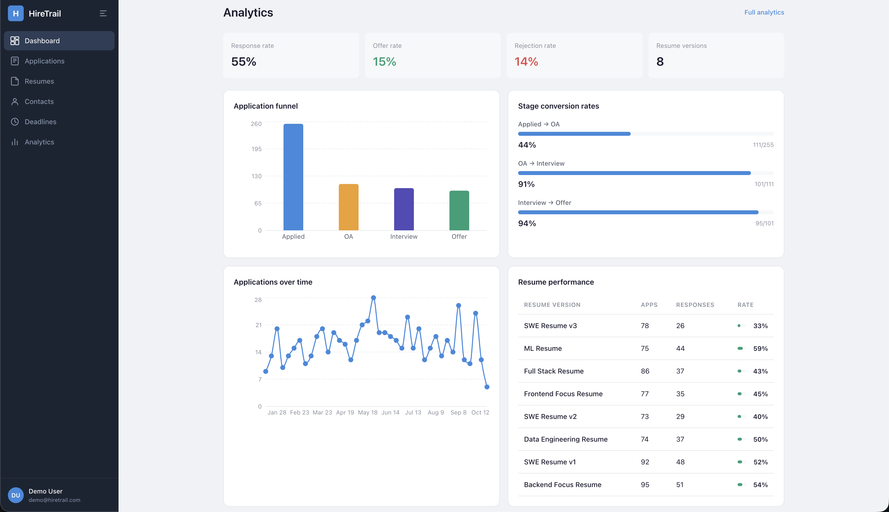

# HireTrail — Internship & Job Application Command Center




## Authors

- **Manav Kaneria** — Applications & Resume Module (Full Stack)
- **Tisha Anil Patel** — Contacts, Deadlines & Analytics Module (Full Stack)

## Class

[CS5610 Web Development — Northeastern University, Khoury College of Computer Sciences](https://johnguerra.co/classes/webDevelopment_fall_2025/)

## Links

- **Live App:** [https://hire-trail.onrender.com](https://hire-trail.onrender.com)
- **Demo Video:** [YouTube link here]
- **Presentation Slides:** [Google Slides link here]
- **Design Document:** [https://drive.google.com/file/d/1uuVTc4PUYyaIpMTHK6DkAzHOQYuqdx5U/view?usp=sharing](https://drive.google.com/file/d/1uuVTc4PUYyaIpMTHK6DkAzHOQYuqdx5U/view?usp=sharing)

---

## Project Objective

HireTrail is a browser-based job search management platform designed for students and early-career professionals navigating internship and full-time recruiting cycles. It goes beyond basic application tracking by combining five interconnected modules into a single command center:

- Track applications through every hiring stage with timestamped history
- Version resumes and measure which version gets the best response rate
- Log contacts, referrals, and recruiters per company with conversation notes
- Manage deadlines with urgency-based color coding and completion tracking
- Analyze your entire funnel with conversion rates, weekly trends, and resume performance breakdowns

The goal is to replace the scattered spreadsheets, sticky notes, and email threads that most students use during recruiting season with a structured, data-driven workflow.

---

## Features

### Dashboard
- At-a-glance stat cards showing total applications, in-progress count, offers, and rejections
- Recent applications table with stage badges
- Upcoming deadlines sorted by urgency
- Embedded analytics section with funnel chart, conversion rates, weekly trend, and resume performance

### Applications (Manav)
- Full CRUD — create, view, edit, and delete job applications
- Each application tracks: company, role, job URL, application date, current stage, notes, and linked resume version
- Stage options: Applied, OA, Interview, Offer, Rejected
- Every stage change is timestamped in a stage history array for timeline visibility
- Filter by stage with count badges
- Search by company or role name
- Direct link to job postings via external URL

### Resumes (Manav)
- Full CRUD for resume versions (metadata-based)
- Each version stores: name, target role type, and file name
- Card grid layout showing all versions with upload dates
- Live usage count per resume pulled from an aggregation pipeline
- Linked to applications — each application tags exactly one resume version

### Contacts (Tisha)
- Full CRUD for contacts at each company
- Each contact stores: name, company, role, LinkedIn URL, connection source, last contact date, and conversation notes
- Connection sources: Cold email, Referral, Career fair, LinkedIn, Professor intro, Alumni network
- Card grid with avatar initials, search by name or company

### Deadlines (Tisha)
- Full CRUD for deadlines linked to applications
- Deadline types: OA due date, Follow-up reminder, Interview prep, Offer decision, Thank you note
- Tab-based filtering: Upcoming, Overdue, Completed, All
- Color-coded urgency badges (overdue = red, urgent = amber, soon = blue, normal = gray)
- One-click completion toggle with visual strikethrough

### Analytics (Tisha)
- Application funnel bar chart (Applied → OA → Interview → Offer)
- Stage-to-stage conversion rates with progress bars
- Applications over time — weekly trend line chart
- Resume performance table — response rate per resume version with visual bars
- Summary stat cards: response rate, offer rate, rejection rate

### Authentication
- Passport.js Local strategy (email + password with bcrypt hashing)
- Passport.js Google OAuth 2.0 strategy
- Session management stored in MongoDB via connect-mongo
- Auto-login after registration
- Protected routes — all API endpoints require authentication

---

## Tech Stack

| Layer | Technology |
|---|---|
| Frontend | React 18 with hooks, client-side rendering only |
| Routing | React Router DOM v6 |
| Charts | Recharts |
| Type Checking | PropTypes |
| Backend | Node.js + Express (ES Modules) |
| Database | MongoDB Atlas with the native driver |
| Authentication | Passport.js (Local + Google OAuth 2.0) |
| Sessions | express-session + connect-mongo |
| Password Hashing | bcrypt |
| Linting | ESLint |
| Formatting | Prettier |
| Deployment | Render |

**Not used (per course rules):** Axios, Mongoose, CORS, or any other prohibited library.

---

## MongoDB Collections

| Collection | Owner | Operations |
|---|---|---|
| `users` | Shared | Create (register), Read (auth) |
| `applications` | Manav | Full CRUD + stage history tracking |
| `resumes` | Manav | Full CRUD + aggregation for usage counts |
| `contacts` | Tisha | Full CRUD |
| `deadlines` | Tisha | Full CRUD + completion toggling |
| `sessions` | System | Managed by connect-mongo |

Database is seeded with **1,000+ synthetic records** across all collections.

---

## Project Structure

```
hiretrail/
├── backend/
│   ├── config/
│   │   ├── db.js              # MongoDB native driver connection
│   │   └── passport.js        # Local + Google OAuth strategies
│   ├── middleware/
│   │   └── auth.js            # Route protection middleware
│   ├── routes/
│   │   ├── auth.js            # Register, login, logout, Google OAuth
│   │   ├── applications.js    # Applications CRUD
│   │   ├── resumes.js         # Resumes CRUD + aggregation
│   │   ├── contacts.js        # Contacts CRUD
│   │   ├── deadlines.js       # Deadlines CRUD
│   │   └── analytics.js       # Aggregation pipelines
│   ├── server.js              # Express app entry point
│   ├── seed.js                # Synthetic data seeder (1,000+ records)
│   ├── .env.example           # Environment variable template
│   ├── .eslintrc.cjs          # Backend ESLint config
│   └── package.json
├── frontend/
│   ├── public/
│   │   └── favicon.svg
│   ├── src/
│   │   ├── components/
│   │   │   ├── Layout/        # Sidebar + content wrapper
│   │   │   ├── Sidebar/       # Collapsible navigation sidebar
│   │   │   └── ProtectedRoute/# Auth guard for routes
│   │   ├── pages/
│   │   │   ├── Login/         # Login page (local + Google)
│   │   │   ├── Register/      # Registration page
│   │   │   ├── Dashboard/     # Overview + embedded analytics
│   │   │   ├── Applications/  # Application tracker with CRUD modal
│   │   │   ├── Resumes/       # Resume version manager
│   │   │   ├── Contacts/      # Contact relationship tracker
│   │   │   ├── Deadlines/     # Deadline manager with urgency
│   │   │   └── Analytics/     # Full analytics dashboard
│   │   ├── utils/
│   │   │   └── api.js         # Centralized fetch wrapper
│   │   ├── App.jsx            # Root component with routing
│   │   ├── App.css            # Global styles (Slate blue palette)
│   │   └── main.jsx           # Entry point
│   ├── .eslintrc.cjs          # Frontend ESLint config
│   ├── vite.config.js         # Vite config with API proxy
│   └── package.json
├── .gitignore
├── .prettierrc
├── LICENSE                    # MIT
├── README.md
└── screenshot.png
```

---

## Instructions to Build

### Prerequisites

- Node.js 18+
- MongoDB Atlas account
- (Optional) Google Cloud Console project for OAuth

### Setup

1. **Clone the repository**

```bash
git clone https://github.com/gititmanav/Hire-Trail.git
cd Hire-Trail
```

2. **Install dependencies**

```bash
cd backend && npm install
cd ../frontend && npm install
```

3. **Configure environment**

```bash
cd backend
cp .env.example .env
```

Edit `backend/.env` with your credentials:

```
MONGO_URI=mongodb+srv://<user>:<password>@<cluster>.mongodb.net/HireTrail?retryWrites=true&w=majority
SESSION_SECRET=any-random-string-here
CLIENT_URL=http://localhost:5173
PORT=5050
```

For Google OAuth (optional):

```
GOOGLE_CLIENT_ID=your-google-client-id
GOOGLE_CLIENT_SECRET=your-google-client-secret
GOOGLE_CALLBACK_URL=http://localhost:5050/api/auth/google/callback
```

4. **Seed the database**

```bash
cd backend
node seed.js
```

This creates a demo user and 1,000+ synthetic records. Login credentials: `demo@hiretrail.com` / `password123`

5. **Run in development**

Terminal 1:
```bash
cd backend
npm run dev
```

Terminal 2:
```bash
cd frontend
npm run dev
```

Open [http://localhost:5173](http://localhost:5173)

6. **Build for production**

```bash
cd frontend
npm run build
cd ../backend
npm start
```

---

## License

[MIT](LICENSE)
