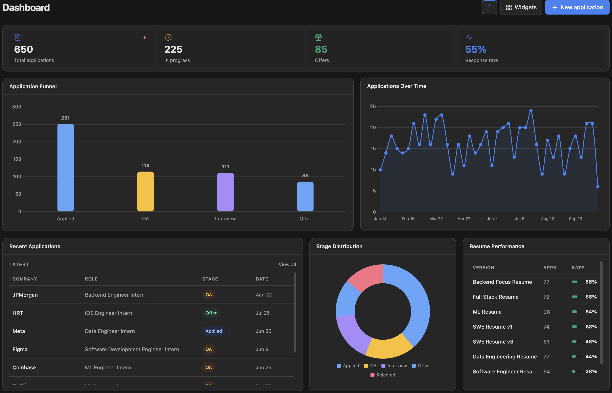
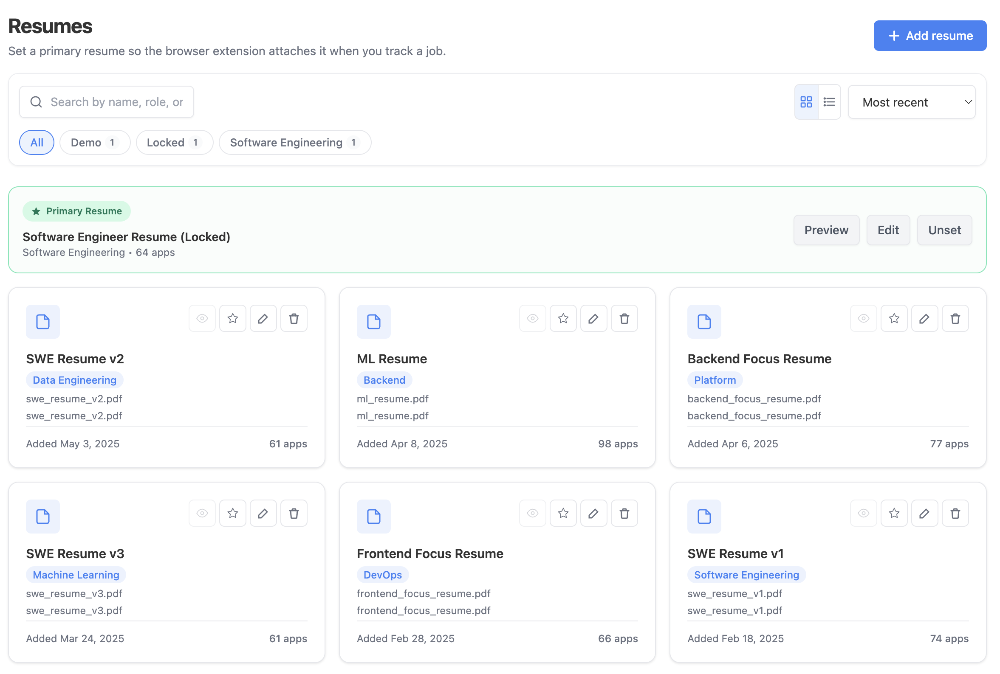

# HireTrail

HireTrail is a full-stack **job-search operating system** for serious candidates: track applications, run your pipeline, tailor a resume to any JD with AI, auto-update statuses from your inbox, and review outcomes with analytics — with a Chrome extension to capture jobs from anywhere.

[](LICENSE)
[](https://nodejs.org/)
[](https://www.typescriptlang.org/)
[](CONTRIBUTING.md)

**Live app:** [hiretrail.manavkaneria.me](https://hiretrail.manavkaneria.me/login) · **Repository:** [github.com/gititmanav/Hire-Trail](https://github.com/gititmanav/Hire-Trail)

> New contributor? Jump to **[Getting started](#getting-started-local-development)** and **[CONTRIBUTING.md](CONTRIBUTING.md)**.

---

## Why HireTrail

Most job trackers are either too simple (a spreadsheet replacement) or too rigid for real recruiting cycles. HireTrail is built for people applying at volume who still want structure, automation, and clean UX.

- **One canonical career profile → tailored resumes per role.** A single Master Profile feeds an AI-first **Resume Studio** that reads a JD, finds the real gap, and rewrites your bullets (STAR, quantified, never fabricated) with a live WYSIWYG preview and a pixel-faithful PDF.
- **Tailor right from an application.** A broad, Jobright-style **tailoring drawer** opens over any application — the per-app fit score *is* step 1, so it jumps straight to "Align."
- **Bring any model.** BYOK through the **Vercel AI Gateway**: 40+ providers (OpenAI, Anthropic, Google, Amazon Bedrock, Mistral, Groq, DeepSeek, xAI, Perplexity, Cohere, …) and hundreds of models, with per-user encrypted keys and transparent **usage metering**.
- **Auto-status from your inbox.** Gmail + Outlook scanning detects interviews, offers, follow-ups, and rejections, with one-click confirm/revert.
- **A full admin platform** — users, RBAC, audit logs, broadcasts, feedback inbox, analytics, mailbox controls.

## Screenshots

| Dashboard (light) | Dashboard (dark) |
| :---: | :---: |
|  |  |

| Kanban (light) | Kanban (dark) |
| :---: | :---: |
|  |  |



## Feature set

### Core job tracking
- **Applications** — full CRUD, server-side search + pagination, stage filters, stage-history timeline, duplicate protection.
- **Kanban pipeline** — drag-and-drop stage management with optimistic updates and stable column layout.
- **Resumes** — versioned resume records with PDF uploads (Cloudinary), per-resume response metrics, and a lineage tree (base → tailored variants).
- **Contacts & companies**, **Calendar** (drag-to-reschedule, quick-add, keyboard shortcuts), **Deadlines**, and **dark mode** everywhere.

### AI tailoring — Resume Studio + the Applications drawer
HireTrail's tailoring is **one engine, two shells**, both over a single editable `ResumeDocument`:
- **Resume Studio** (`/resume-studio`) — the manual entry point. A 3-step flow:
  1. **See the gap** — the LLM reads the JD, strips posting noise (applicant counts, "Easy Apply", boilerplate), and returns the real requirement keywords, matched/missing skills, and a per-section read. A **deterministic 0–10 match score** + coverage ring are computed against your document so the number never lies.
  2. **Align** — choose which sections/keywords to weave in (only what you genuinely have).
  3. **Review** — AI rewrites in **STAR**, quantified only where your real results support it (**strict no-fabrication** — employers, titles, dates, and metrics are never invented). Live preview = the print template; **Download** renders a pixel-faithful PDF via Gotenberg.
- **Application tailoring drawer** — a broad drawer over any application that reuses the exact Studio flow. Because the per-application **fit score is step 1**, the drawer opens at "Align." Each application tailors its **own variant** (so roles never clobber each other), with fail-in-place AI states (Retry / "Add a key", never a stuck spinner).
- **Master Profile** — one canonical career history (Personal · Experience · Projects · Education · Skills · Certifications) that seeds every resume and the extension.

### AI platform (BYOK via the Vercel AI Gateway)
- **40+ providers, hundreds of models** — the provider/model catalog is fetched live from the gateway, so new models appear without a code change. Browse and search models per provider in **Settings → AI & Models**.
- **Bring your own key** — per-user keys encrypted at rest (AES-GCM). Single-key shapes (most providers) and multi-field credentials (Bedrock `accessKeyId/secretAccessKey/region`, Azure, Vertex) are handled. Exactly one key active at a time.
- **Admin default + quota** — admins can set a platform default provider/model (or use gateway system credits) and a per-user monthly token quota for default-key users.
- **Usage metering** — every LLM call (parsing, fit analysis, rewrites, …) is metered: per-operation tokens, call counts, and **estimated cost using live gateway pricing**. Visible in Settings → AI & Models.
- **Reliability** — one central runner with content-hash caching, retry/backoff, per-user rate limit, and quota enforcement. AI runs through the gateway when `AI_GATEWAY_API_KEY` is set; otherwise the four direct-SDK providers (OpenAI/Anthropic/Google/OpenRouter) still work for local dev.

### Inbox auto-status (Gmail + Outlook)
- Source-agnostic pipeline: pre-filter → dedupe → LLM classify → application match → stage update + notification.
- Signals: `interview_detected`, `offer_detected`, `follow_up_detected`, `rejection_detected`. **Confirm / revert** on every auto-applied change. Nightly cron (`0 1 * * *`) per connected mailbox.

### Analytics, feedback & admin
- Draggable/resizable dashboard widgets; pipeline funnel, conversion rates, resume metrics, AI provider mix, mailbox adoption; CSV import/export; theme-aware charts.
- In-app feedback widget + an Admin Feedback Inbox.
- Admin platform: Dashboard KPIs, User Management + bulk email, Broadcasts, Mailbox Management, Notification Center, Platform Analytics, Audit Logs, Email Templates, Announcements, Invites, Backups, Seed Data, System Config, **AI System Config** (default provider/model + quota), Storage, Content Moderation, RBAC — with feature flags for progressive rollout.

### Browser extension (Chrome, Manifest V3)
- One-click job tracking from LinkedIn, Indeed, Greenhouse, Lever, Glassdoor, and Workday; smart page scraping; auto-track on apply.
- **"Tailor with AI"** scrapes the JD, creates a draft application server-side, and opens the **Applications tailoring drawer** in the web app (no JD in the URL).
- Email/password, Google, or session-handoff auth; daily tracked-job badge.

## Tech stack

| Layer | Stack |
|------|-------|
| Frontend | React 18, TypeScript, Vite, Tailwind CSS, React Router |
| Backend | Express (ESM), TypeScript, Mongoose, Zod |
| Auth | Passport Local + Google OAuth 2.0, sessions (connect-mongo), extension JWT |
| AI | **Vercel AI Gateway** (`@ai-sdk/gateway`) for BYOK to 40+ providers; per-provider SDKs (`@ai-sdk/{anthropic,openai,google}`, `@openrouter/...`) as a direct fallback; Zod structured output |
| PDF | **Gotenberg** (Chromium HTML→PDF) for pixel-faithful resume export |
| Mail | nodemailer over SMTP (broadcasts); Gmail API + Microsoft Graph (`@azure/msal-node`) for inbox scanning |
| Storage | MongoDB (Mongoose), Cloudinary (resume PDFs) |
| UI/Charts | react-grid-layout, @dnd-kit, Chart.js, react-chartjs-2 |
| Security | Helmet CSP, rate limiting, httpOnly cookies, CORS allowlist, AES-GCM for BYOK keys |

## Repository layout

```text
Hire-Trail/
├── backend/              # Express API, AI platform, jobs, admin services
│   ├── src/
│   │   ├── routes/       # REST endpoints (ai, admin/ai, resumes, tailor, applications, …)
│   │   ├── services/ai/  # gateway resolver, central runner, catalog, usage, pricing, rewrite, tailor
│   │   ├── services/resume/  # ResumeDocument engine: document, score, suggestions, keywords, html
│   │   ├── services/pdf/ # Gotenberg HTML→PDF
│   │   ├── models/       # Mongoose models
│   │   └── config/       # env (loads .env.local then .env)
│   ├── scripts/devSeed.ts
│   └── DEV_LOCAL.md
├── frontend/             # React SPA (pages/ResumeStudio, pages/Applications, pages/Settings, …)
├── extension/            # Chrome extension (MV3): content / background / popup
├── docker-compose.yml    # Local dev MongoDB (hiretrail-dev-db)
├── CONTRIBUTING.md
└── README.md
```

## Getting started (local development)

### Prerequisites
- **Node.js 18+**
- **A local MongoDB** — Docker (recommended) or a native `mongod`. (You can also point at MongoDB Atlas, but prefer a local DB for dev.)
- Optional integrations: an **AI Gateway key** (for the full provider catalog), Google OAuth, Cloudinary, Gotenberg (PDF export), Gmail/Outlook.

### 1) Install
```bash
git clone https://github.com/gititmanav/Hire-Trail.git
cd Hire-Trail
npm run install-all
```

### 2) Configure environment
```bash
cp backend/.env.example backend/.env
cp frontend/.env.example frontend/.env
```
Minimum to boot: `SESSION_SECRET` (any string locally) and `MONGO_URI`. For local dev, **create `backend/.env.local`** to keep dev off any production DB — it's loaded *before* `.env` and is gitignored:
```bash
echo 'MONGO_URI=mongodb://127.0.0.1:27017/hiretrail_dev' > backend/.env.local
```
For the full AI catalog, set `AI_GATEWAY_API_KEY` (see [AI configuration](#ai-configuration)). See the [environment reference](#environment-reference) for everything else.

### 3) Start the local database
```bash
npm run db:up      # Docker: starts mongo:7 as "hiretrail-dev-db" on :27017 (persistent volume)
npm run db:seed    # seeds a dev user + master profile + resume + sample application
# → login dev@hiretrail.local / devpass123
```
No Docker? Use the native fallback: `cd backend && npm run db:up:local` (data in `backend/.localdb/`), then `npm run db:seed`. Full details in **[backend/DEV_LOCAL.md](backend/DEV_LOCAL.md)**.

### 4) Run the app
```bash
npm run dev:backend     # Express on :5050 (uses .env.local → local DB)
npm run dev:frontend    # Vite on :5173, proxies /api → :5050
```
Open **http://localhost:5173** and sign in with the seeded account.

## AI configuration
- **`AI_GATEWAY_API_KEY`** (recommended) routes every call through the Vercel AI Gateway and unlocks **all 40+ providers + every model** with per-user BYOK. Create a key in the Vercel dashboard → AI Gateway (BYOK requires AI Gateway credits — see [Vercel docs](https://vercel.com/docs/ai-gateway/authentication-and-byok/byok)).
- **Without the gateway**, the four direct-SDK providers still work if their env keys are set: `GOOGLE_GENERATIVE_AI_API_KEY` (free Gemini tier — easiest), `ANTHROPIC_API_KEY`, `OPENAI_API_KEY`, `OPENROUTER_API_KEY`.
- Users add their own keys in **Settings → AI & Models**; admins set the platform default + quota in **Admin → AI**.

## Environment reference

<details>
<summary><strong>Backend (<code>backend/.env</code>)</strong></summary>

**Required:** `MONGO_URI`, `SESSION_SECRET`, `CLIENT_URL` (must match the frontend origin).

**AI:** `AI_GATEWAY_API_KEY` (gateway BYOK), or one of `GOOGLE_GENERATIVE_AI_API_KEY` / `ANTHROPIC_API_KEY` / `OPENAI_API_KEY` / `OPENROUTER_API_KEY`; `ENCRYPTION_KEY` (64-char hex, encrypts stored BYOK keys).

**PDF export:** `GOTENBERG_URL` (a Gotenberg instance; Studio PDF download is disabled without it).

**Auth:** `GOOGLE_CLIENT_ID`, `GOOGLE_CLIENT_SECRET`, `GOOGLE_CALLBACK_URL`; `ADMIN_EMAILS` (comma-separated admins); `MAINTENANCE_BYPASS_EMAIL` (optional).

**Inbox scanning (optional):** `MICROSOFT_CLIENT_ID` / `MICROSOFT_CLIENT_SECRET` / `MICROSOFT_TENANT_ID` + `OUTLOOK_REDIRECT_URI` (Outlook); Gmail OAuth via the Google client above.

**Broadcasts (optional):** `EMAIL_SENDER`, `EMAIL_APP_PASSWORD` (Google App Password, needs 2FA), `EMAIL_SENDER_NAME`, `EMAIL_SMTP_HOST`/`EMAIL_SMTP_PORT`. The Broadcasts page shows a clear banner + disables Send when unset.

**Other (optional):** Cloudinary (`CLOUDINARY_*`), `JSEARCH_API_KEY`, `SENTRY_DSN`/`SENTRY_ENVIRONMENT`.
</details>

<details>
<summary><strong>Frontend (<code>frontend/.env</code>)</strong></summary>

- `VITE_API_PROXY_TARGET` — local dev proxy target (default `http://localhost:5050`).
- `VITE_API_BASE_URL` — only for split frontend/API deployments (include `/api`).
- `VITE_SENTRY_DSN` / `VITE_SENTRY_ENVIRONMENT` — optional error tracking.
</details>

## Deployment notes
- **Monolith:** build the frontend, build the backend, serve `frontend/dist` from the backend.
- **Split:** set frontend `VITE_API_BASE_URL` and backend `CLIENT_URL` to the deployed origins; production cross-origin cookies use `SameSite=None; Secure`.
- On Vercel, add all `EMAIL_*`, `MICROSOFT_*`, AI provider keys, **`AI_GATEWAY_API_KEY`**, **`GOTENBERG_URL`**, `ENCRYPTION_KEY`, and `ADMIN_EMAILS` to the project environment.

## Chrome extension (optional)
1. `chrome://extensions` → enable Developer Mode → **Load unpacked** → select `extension/`.
2. Sign in via the popup, then track jobs from supported boards.
3. On a JD page, use **Tailor with AI** to open the tailoring drawer in the web app.

## Contributing
PRs welcome — see **[CONTRIBUTING.md](CONTRIBUTING.md)** for the dev setup, project architecture, coding conventions, and PR/commit guidelines. The non-negotiables: `cd backend && npx tsc --noEmit` and `cd frontend && npm run build` must stay green, and AI calls must go through the central runner (`backend/src/services/ai/run.ts`).

## Breaking changes (recent)
| Change | Notes |
|---|---|
| `/tailor` page removed | Replaced by the AI-first Resume Studio + the per-application tailoring drawer. Deep-links resolve to `/applications?tailor=<appId>` (or `?tailorSession=<id>`). |
| Typst PDF removed | Resume export is now Gotenberg HTML→PDF (pixel-faithful WYSIWYG). |
| AI providers no longer a fixed set of 4 | BYOK now covers every Vercel AI Gateway provider; `AIProviderConfig.provider` is a free string. |
| `/api/resume-profile/*` → `/api/master-profile/*` | Old `ResumeProfile` docs are orphaned; re-parse from the Profile page. |
| `/admin/gmail` → `/admin/mailbox` | Gmail + Outlook unified. |

## License
MIT — see [LICENSE](LICENSE).
