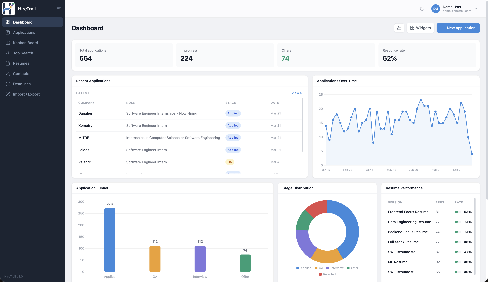

# HireTrail

A full-stack **job search command center**: applications, Kanban pipeline, deadlines, contacts, resume versions with uploads, analytics, and an integrated job search. Built as a personal project to stay organized during recruiting and to ship a polished reference implementation others can run and learn from.

**Live:** [hire-trail.onrender.com](https://hire-trail.onrender.com)  
**Repo:** [github.com/gititmanav/Hire-Trail](https://github.com/gititmanav/Hire-Trail)

### Dashboard

Customizable widget grid (funnel, trends, deadlines, recent applications, and more) in light and dark theme.

| Light | Dark |
| :---: | :---: |
|  |  |

---

## Features (product)

- **Dashboard** – Drag-and-drop, resizable widgets (`react-grid-layout`): funnel, conversion, trends, stage mix, resume performance, recent applications, deadlines. Lock layout, show/hide widgets, persist layout in `localStorage`. First-visit hint for discoverability.
- **Applications** – Full CRUD with server-side search and pagination, stage filters, and **timestamped stage history** for a real audit trail.
- **Kanban** – **Drag-and-drop cards across hiring stages** (`@dnd-kit`); optimistic UI with throttled updates during drag; persists stage to the API on drop.


- **Resumes** – Versioned metadata, **PDF upload** to Cloudinary, usage counts from aggregation, linked to applications.
- **Contacts** – People per company with source, notes, and LinkedIn links; paginated lists.
- **Deadlines** – Tied to applications; tabs for upcoming / overdue / completed; urgency styling; quick complete toggle.
- **Analytics** – Funnel counts, conversion rates, weekly trend, resume-level performance (MongoDB aggregations).
- **Import / export** – CSV bulk import for applications; export paths for portability.
- **Job search** – In-app listings via **JSearch (RapidAPI)** when `JSEARCH_API_KEY` is set; optional remote/location filters.


- **Auth** – Email/password, **Google OAuth 2.0**, sessions stored in MongoDB (`connect-mongo`); profile and password change flows.
- **UX** – Dark/light theme with a **circular reveal** transition, toast notifications, skeleton loading, responsive layout.

---

## Engineering highlights (for builders)

| Area | Choices |
|------|---------|
| **API & data** | **Express** (ESM), **Mongoose** models, compound indexes, aggregation pipelines for analytics and resume usage |
| **Validation** | **Zod** at the boundary; centralized error handler mapping Zod / Mongoose / `AppError` |
| **Auth** | **Passport.js**: `passport-local` + **Google OAuth 2.0**; **bcrypt**; `express-session` + **connect-mongo** |
| **Security** | **Helmet** CSP, **express-rate-limit** on `/api`, httpOnly cookies, production `secure` cookies behind proxy |
| **Files** | **Multer** + **Cloudinary** for resume PDFs |
| **Frontend** | **React 18**, **TypeScript**, **Vite**, **Tailwind CSS**, **React Router v6** |
| **HTTP** | **Axios** instance with `withCredentials`, response interceptor for 401/429 and user-facing errors |
| **Charts** | **Chart.js** + `react-chartjs-2`, `chartjs-plugin-datalabels` |
| **Layout / DnD** | **react-grid-layout** (dashboard), **@dnd-kit** (Kanban) |
| **CSV** | **Papa Parse** for parsing and robust import |
| **Job API** | Server-side proxy to JSearch so the API key stays off the client |

---

## Repository layout

```
Hire Trail/
├── backend/          # Express API (TypeScript → dist/)
│   └── src/
│       ├── config/   # env (Zod), db, passport, cloudinary
│       ├── models/   # Mongoose schemas
│       ├── routes/   # REST handlers
│       ├── middleware/
│       └── server.ts
├── frontend/         # Vite + React SPA
│   └── src/
├── README.md
└── LICENSE
```

---

## Setup

### Prerequisites

- **Node.js 18+**
- **MongoDB Atlas** (or compatible URI)
- Optional: **Google Cloud** OAuth credentials; **Cloudinary** account; **RapidAPI** key for JSearch

### 1. Clone and install

```bash
git clone https://github.com/gititmanav/Hire-Trail.git
cd Hire-Trail
cd backend && npm install
cd ../frontend && npm install
```

### 2. Environment (backend)

```bash
cd backend
cp .env.example .env
```

Edit `backend/.env`: set `MONGO_URI`, `SESSION_SECRET`, and optionally Google, Cloudinary, and `JSEARCH_API_KEY`. Use `CLIENT_URL` matching the frontend origin (e.g. `http://localhost:5173` in development).

### 3. Seed demo data

```bash
cd backend
npm run seed
```

Creates **demo@hiretrail.com** / **password123** plus synthetic data for applications, resumes, contacts, and deadlines.

### 4. Development (two terminals)

**API** (default port `5050`):

```bash
cd backend
npm run dev
```

**SPA** (Vite proxies `/api` to the backend):

```bash
cd frontend
npm run dev
```

Open [http://localhost:5173](http://localhost:5173).

### 5. Production build

```bash
cd frontend && npm run build
cd ../backend && npm run build && npm start
```

The server serves the Vite output from `frontend/dist` when deployed as a single unit (e.g. Render). Set `NODE_ENV=production` and a strong `SESSION_SECRET`; configure OAuth callback URL for your public API origin.

---

## License

[MIT](LICENSE)
