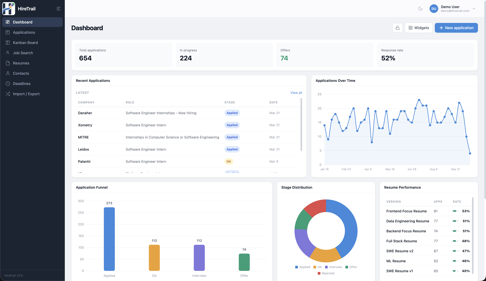
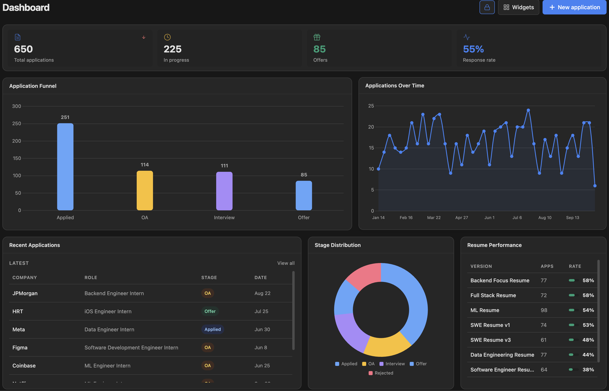
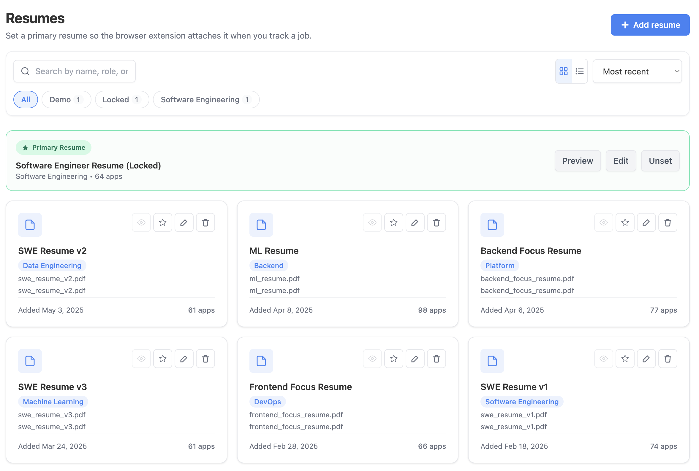

# HireTrail

HireTrail is a full-stack **job-search operating system** for serious candidates: track applications, run your pipeline, tailor a resume to any JD with AI, auto-update statuses from your inbox, and review outcomes with analytics — with a Chrome extension to capture jobs from anywhere.

[](LICENSE)
[](https://nodejs.org/)
[](https://www.typescriptlang.org/)
[](CONTRIBUTING.md)

**Live app:** [hiretrail.manavkaneria.me](https://hiretrail.manavkaneria.me/login) · **Repository:** [github.com/gititmanav/Hire-Trail](https://github.com/gititmanav/Hire-Trail)

> New contributor? Jump to **[Getting started](#getting-started-local-development)** and **[CONTRIBUTING.md](CONTRIBUTING.md)**.

---

## Why HireTrail

Most job trackers are either too simple (a spreadsheet replacement) or too rigid for real recruiting cycles. HireTrail is built for people applying at volume who still want structure, automation, and clean UX.

- **One canonical career profile → tailored resumes per role.** A single Master Profile feeds an AI-first **Resume Studio** that reads a JD, finds the real gap, and rewrites your bullets (STAR, quantified, never fabricated) with a live WYSIWYG preview and a pixel-faithful PDF.
- **Tailor right from an application.** A broad, Jobright-style **tailoring drawer** opens over any application — the per-app fit score *is* step 1, so it jumps straight to "Align."
- **Your AI, your way.** Built-in AI that's free within a monthly allowance — or your own key from 8 providers (Google Gemini, Anthropic, OpenAI, xAI, DeepSeek, Mistral, Groq, OpenRouter), or your own Claude Code over MCP. You choose per feature on an AI map.
- **Inbox review.** A Gmail scan finds application emails — interviews, assessments, offers, rejections — and lines them up for you to review. Nothing changes until you accept it.
- **A lean admin** — users, AI policy and budget, broadcasts, feedback, bug reports, audit logs.

## Screenshots

| Dashboard (light) | Dashboard (dark) |
| :---: | :---: |
|  |  |

| Kanban (light) | Kanban (dark) |
| :---: | :---: |
|  |  |



## Feature set

### Core job tracking
- **Applications** — full CRUD, server-side search + pagination, stage filters, stage-history timeline, duplicate protection.
- **Kanban pipeline** — drag-and-drop stage management with optimistic updates and stable column layout.
- **Resumes** — versioned resume records with PDF uploads (Cloudinary), per-resume response metrics, and a lineage tree (base → tailored variants).
- **Contacts & companies**, **Calendar** (drag-to-reschedule, quick-add, keyboard shortcuts), **Deadlines**, and **dark mode** everywhere.

### AI tailoring — Resume Studio + the Applications drawer
HireTrail's tailoring is **one engine, two shells**, both over a single editable `ResumeDocument`:
- **Resume Studio** (`/resume-studio`) — the manual entry point. A 3-step flow:
  1. **See the gap** — the LLM reads the JD, strips posting noise (applicant counts, "Easy Apply", boilerplate), and returns the real requirement keywords, matched/missing skills, and a per-section read. A **deterministic 0–10 match score** + coverage ring are computed against your document so the number never lies.
  2. **Align** — choose which sections/keywords to weave in (only what you genuinely have).
  3. **Review** — AI rewrites in **STAR** arrive as **proposals** you accept per change (or all); a rewrite that adds a number your resume doesn't have is dropped (**strict no-fabrication** — employers, titles, dates and metrics are never invented). Live preview = the print template; **Download** renders a pixel-faithful PDF via Gotenberg.
- **Application tailoring drawer** — a broad drawer over any application that reuses the exact Studio flow. Because the per-application **fit score is step 1**, the drawer opens at "Align." Each application tailors its **own variant** (so roles never clobber each other), with fail-in-place AI states (Retry / "Add a key", never a stuck spinner).
- **Master Profile** — one canonical career history (Personal · Experience · Projects · Education · Skills · Certifications) that seeds every resume and the extension.

### AI platform — three lanes, one door
- **Lanes, per feature:** **Included** (HireTrail's platform keys, paid by HireTrail within a budget), **My key** (the person's own provider key), **My assistant** (their own Claude Code or other MCP client, on their subscription), or **Off**. People move features on an **AI map** in **Settings → AI**; admins set the rules in **Admin → AI**.
- **8 providers, direct** — Google Gemini, Anthropic, OpenAI, xAI, DeepSeek, Mistral, Groq and OpenRouter through their own AI SDK adapters. Each key lists its live models; keys are encrypted at rest (AES-GCM), tested before they're saved, and carry a health check.
- **Admin control** — a master switch with a pause message, lanes on/off, per-feature rules (on/off, allowed lanes, a lane everyone is put on, the default, Included runs per month), a monthly budget and per-person allowance, and per-user overrides. Every change is audit-logged.
- **Metered** — every call, refusal and failure is a ledger row (feature, lane, model, tokens, cost); Included spend is reserved before a call and settled after, so parallel calls can't overshoot the budget.
- **Long work is a job** — saved and resumable: steps with a deadline that continue themselves, revived when anyone checks on them. No worker server.
- **MCP** — `/api/mcp` (stateless Streamable HTTP) with personal tokens: Claude Code can read your search, track and update jobs, and run the features you put in the My assistant lane.
- **The match score is one number** — a deterministic 0–10 score; the AI's read is words (strengths, gaps, what to change).

### Inbox review (Gmail)
- Settings → Connectors → Gmail (read-only scope). A scan reads recent application emails and every result lands in a **review queue** — import it, merge it into an existing application, or skip it. Nothing changes in your tracker until you accept it. (Outlook is hidden until it joins the queue.)

### Analytics, feedback & admin
- Draggable/resizable dashboard widgets; pipeline funnel, conversion rates, resume metrics; CSV import/export; theme-aware charts.
- In-app feedback widget + an Admin Feedback Inbox.
- Admin: Dashboard, Users, Announcements, Broadcasts, Notifications, Mailboxes, Feedback, Bug reports, **AI** (Map · Rules · Spend), Settings (maintenance mode, feature switches, reset the demo) and Audit logs.

### Browser extension (Chrome, Manifest V3)
- One-click job tracking from LinkedIn, Indeed, Greenhouse, Lever, Glassdoor, and Workday; smart page scraping; auto-track on apply.
- **"Tailor with AI"** scrapes the JD, creates a draft application server-side, and opens the **Applications tailoring drawer** in the web app (no JD in the URL).
- Email/password, Google, or session-handoff auth; daily tracked-job badge.

## Tech stack

| Layer | Stack |
|------|-------|
| Frontend | React 18, TypeScript, Vite, Tailwind CSS, React Router |
| Backend | Express (ESM), TypeScript, Mongoose, Zod |
| Auth | Passport Local + Google OAuth 2.0, sessions (connect-mongo), extension JWT |
| AI | AI SDK v6 (`ai`) with one adapter per provider (`@ai-sdk/{google,anthropic,openai,xai,deepseek,mistral,groq}`, `@openrouter/ai-sdk-provider`); Zod structured output; MCP server (`@modelcontextprotocol/sdk`) |
| PDF | **Gotenberg** (Chromium HTML→PDF) for pixel-faithful resume export |
| Mail | nodemailer over SMTP (broadcasts); Gmail API + Microsoft Graph (`@azure/msal-node`) for inbox scanning |
| Storage | MongoDB (Mongoose), Cloudinary (resume PDFs) |
| UI/Charts | react-grid-layout, @dnd-kit, Chart.js, react-chartjs-2 |
| Security | Helmet CSP, rate limiting, httpOnly cookies, CORS allowlist, AES-GCM for AI keys and mailbox tokens |

## Repository layout

```text
Hire-Trail/
├── backend/              # Express API, AI platform, jobs, admin services
│   ├── src/
│   │   ├── routes/       # REST endpoints (ai, admin/ai, resumes, tailor, applications, …)
│   │   ├── services/ai/  # the AI layer: registry, provider adapters, routing, gateway (the one door), ledger, jobs, features/
│   │   ├── services/mcp/ # the MCP server and personal tokens
│   │   ├── services/resume/  # ResumeDocument engine: document, score, suggestions, keywords, html
│   │   ├── services/pdf/ # Gotenberg HTML→PDF
│   │   ├── models/       # Mongoose models
│   │   └── config/       # env (loads .env.local then .env)
│   ├── scripts/devSeed.ts
│   └── DEV_LOCAL.md
├── frontend/             # React SPA (pages/ResumeStudio, pages/Applications, pages/Settings, …)
├── extension/            # Chrome extension (MV3): content / background / popup
├── docker-compose.yml    # Local dev MongoDB (hiretrail-dev-db)
├── CONTRIBUTING.md
└── README.md
```

## Getting started (local development)

### Prerequisites
- **Node.js 18+**
- **A local MongoDB** — Docker (recommended) or a native `mongod`. (You can also point at MongoDB Atlas, but prefer a local DB for dev.)
- Optional integrations: an AI provider key (added in the app — see [AI configuration](#ai-configuration)), Google OAuth, Cloudinary, Gotenberg (PDF export), Gmail.

### 1) Install
```bash
git clone https://github.com/gititmanav/Hire-Trail.git
cd Hire-Trail
npm run install-all
```

### 2) Configure environment
```bash
cp backend/.env.example backend/.env
cp frontend/.env.example frontend/.env
```
Minimum to boot: `SESSION_SECRET` (any string locally) and `MONGO_URI`. For local dev, **create `backend/.env.local`** to keep dev off any production DB — it's loaded *before* `.env` and is gitignored:
```bash
echo 'MONGO_URI=mongodb://127.0.0.1:27017/hiretrail_dev' > backend/.env.local
```
AI keys aren't environment variables — they're added in the app (see [AI configuration](#ai-configuration)). See the [environment reference](#environment-reference) for everything else.

### 3) Start the local database
```bash
npm run db:up      # Docker: starts mongo:7 as "hiretrail-dev-db" on :27017 (persistent volume)
npm run db:seed    # seeds a dev user + master profile + resume + sample application, and a local admin
# → login dev@hiretrail.local / devpass123 (a normal user) or admin@hiretrail.local / devpass123 (admin)
```
No Docker? Use the native fallback: `cd backend && npm run db:up:local` (data in `backend/.localdb/`), then `npm run db:seed`. Full details in **[backend/DEV_LOCAL.md](backend/DEV_LOCAL.md)**.

### 4) Run the app
```bash
npm run dev:backend     # Express on :5050 (uses .env.local → local DB)
npm run dev:frontend    # Vite on :5173, proxies /api → :5050
```
Open **http://localhost:5173** and sign in with the seeded account.

## AI configuration
- Set `ENCRYPTION_KEY` (64 hex chars) — every stored AI key and mailbox token is encrypted under it.
- **Included AI:** sign in as an admin → **Admin → AI → Map** → add a platform key (any of the 8 providers; a free Google AI Studio key is the easiest start). Set the budget and rules under **Rules** and **Spend**.
- **Your own key:** **Settings → AI → Your keys**, then move features onto it on the map.
- **Your assistant:** **Settings → AI → Your assistant** → Connect Claude Code (a personal MCP token).
- Developing the AI layer? Test with the AI SDK's mock model (`MockLanguageModelV3`) against the local DB — never real keys in scripts.

## Environment reference

<details>
<summary><strong>Backend (<code>backend/.env</code>)</strong></summary>

**Required:** `MONGO_URI`, `SESSION_SECRET`, `CLIENT_URL` (must match the frontend origin).

**AI:** `ENCRYPTION_KEY` (64-char hex; encrypts stored AI keys and mailbox tokens — never change it without re-encrypting). Long AI jobs: `API_PUBLIC_URL` (the API's public origin, for self-continuation; falls back to the `GOOGLE_CALLBACK_URL` origin) and `FUNCTION_MAX_DURATION_S` (default 300). Provider keys live in the database, added in the app.

**PDF export:** `GOTENBERG_URL` (a Gotenberg instance; Studio PDF download is disabled without it).

**Auth:** `GOOGLE_CLIENT_ID`, `GOOGLE_CLIENT_SECRET`, `GOOGLE_CALLBACK_URL`; `ADMIN_EMAILS` (comma-separated admins); `MAINTENANCE_BYPASS_EMAIL` (optional).

**Inbox scanning (optional):** Gmail OAuth via the Google client above + `GMAIL_REDIRECT_URI`. (The `MICROSOFT_*` / `OUTLOOK_REDIRECT_URI` settings stay for Outlook, which is hidden for now.)

**Broadcasts (optional):** `EMAIL_SENDER`, `EMAIL_APP_PASSWORD` (Google App Password, needs 2FA), `EMAIL_SENDER_NAME`, `EMAIL_SMTP_HOST`/`EMAIL_SMTP_PORT`. The Broadcasts page shows a clear banner + disables Send when unset.

**Other (optional):** Cloudinary (`CLOUDINARY_*`), `JSEARCH_API_KEY`, `SENTRY_DSN`/`SENTRY_ENVIRONMENT`.
</details>

<details>
<summary><strong>Frontend (<code>frontend/.env</code>)</strong></summary>

- `VITE_API_PROXY_TARGET` — local dev proxy target (default `http://localhost:5050`).
- `VITE_API_BASE_URL` — only for split frontend/API deployments (include `/api`).
- `VITE_SENTRY_DSN` / `VITE_SENTRY_ENVIRONMENT` — optional error tracking.
</details>

## Deployment notes
- **Monolith:** build the frontend, build the backend, serve `frontend/dist` from the backend.
- **Split:** set frontend `VITE_API_BASE_URL` and backend `CLIENT_URL` to the deployed origins; production cross-origin cookies use `SameSite=None; Secure`.
- On Vercel, add all `EMAIL_*`, **`GOTENBERG_URL`**, **`ENCRYPTION_KEY`**, `API_PUBLIC_URL`, `ADMIN_EMAILS` (and `FUNCTION_MAX_DURATION_S` if your plan's limit isn't 300 s) to the project environment, then add a platform AI key in Admin → AI. No cron is needed: due account deletions and stuck jobs are swept at boot, hourly, and on status reads.

## Chrome extension (optional)
1. `chrome://extensions` → enable Developer Mode → **Load unpacked** → select `extension/`.
2. Sign in via the popup, then track jobs from supported boards.
3. On a JD page, use **Tailor with AI** to open the tailoring drawer in the web app.

## Contributing
PRs welcome — see **[CONTRIBUTING.md](CONTRIBUTING.md)** for the dev setup, project architecture, coding conventions, and PR/commit guidelines. The non-negotiables: `cd backend && npx tsc --noEmit` and `cd frontend && npm run build` must stay green, and AI calls must go through the one door (`runAiObject` / `runAiText` in `backend/src/services/ai/gateway.ts`).

## Breaking changes (recent)
| Change | Notes |
|---|---|
| `/tailor` page removed | Replaced by the AI-first Resume Studio + the per-application tailoring drawer. Deep-links resolve to `/applications?tailor=<appId>` (or `?tailorSession=<id>`). |
| Typst PDF removed | Resume export is now Gotenberg HTML→PDF (pixel-faithful WYSIWYG). |
| Vercel AI Gateway removed (2026-10) | Direct adapters for 8 providers. Keys moved from `AIProviderConfig` to `AiKey` (a boot migration copies supported ones); the gateway and per-provider env keys are no longer read. |
| One match score (2026-10) | The A–F fit grade is gone; the fit check's number is the deterministic 0–10 score. |
| Inbox auto-apply removed (2026-10) | Every Gmail scan lands in the review queue. `/settings/mailboxes` → `/settings/connectors` (redirects). |
| `/api/resume-profile/*` → `/api/master-profile/*` | Old `ResumeProfile` docs are orphaned; re-parse from the Profile page. |
| `/admin/gmail` → `/admin/mailbox` | Gmail + Outlook unified. |

## License
MIT — see [LICENSE](LICENSE).
